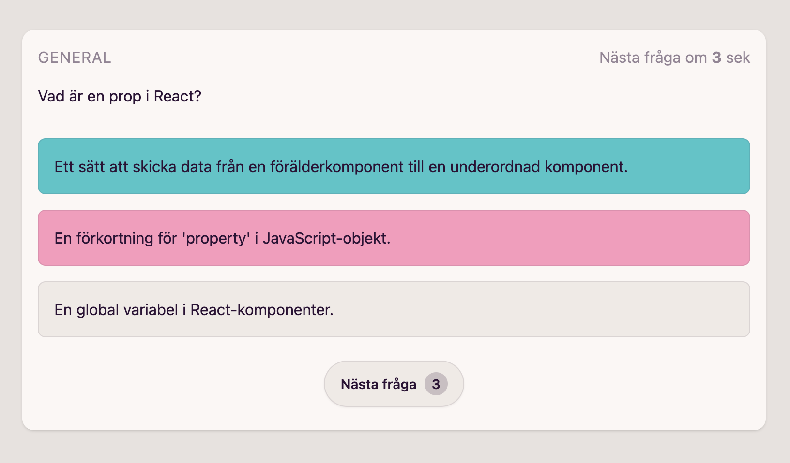

# React Quiz

Välkommen till React Quiz-projektet! Här kan du bidra med frågor om React och testa din kunskap om biblioteket. Följ nedan för att delta och lägga till dina egna frågor.

## Hur du bidrar

1. **Forka detta repository.**

2. **Klona din fork till din lokala maskin:**

   ```bash
   git clone https://github.com/thejoltjoker/FSU23D-frameworks-react-quiz
   ```

3. **Navigera till projektmappen:**

   ```bash
   cd FSU23D-frameworks-react-quiz
   ```

4. **Skapa en ny gren för dina ändringar:**

   ```bash
   git checkout -b questions
   ```

5. **Gå till mappen `src/questions` och skapa en ny fil för dina frågor i valfri kategori, t.ex. `src/questions/react-hooks.ts`:**

   ```typescript
   // Exempel på struktur för en fråga
   import { Question, CorrectAnswer, IncorrectAnswer } from '../types';

   export const myQuestions: Question[] = [
     new Question("Vad är huvudsyftet med `useEffect` i React med TypeScript?", [
       new CorrectAnswer("Utföra sidoeffekter i funktionella komponenter"),
       new IncorrectAnswer("Hantera tillstånd i funktionella komponenter"),
       new IncorrectAnswer("Skapa globala tillstånd i hela applikationen"),
     ]),
     // Lägg till fler frågor här
   ];
   ```

6. **Lägg till och ändra frågor enligt ditt önskemål.**

7. **Skapa en pull request:**

   ```bash
   git add .
   git commit -m "Lägg till frågor om React-hooks"
   git push origin questions
   ```

   Gå sedan till ditt forkade repo på GitHub och skapa en pull request.

8. **Vänta på godkännande och se dina frågor inkluderade i projektet!**

## Kategorier

- [React Hooks](src/questions/react-hooks.ts)
- [UseEffect](src/questions/use-effect.ts)
- [UseContext](src/questions/use-context.ts)
- [UseReducer](src/questions/use-reducer.ts)
- [Generella React-frågor](src/questions/react-general.ts)

Låt oss tillsammans skapa en mångfald av frågor för att göra detta quiz ännu mer användbart och roligt!

Tack för ditt bidrag!
